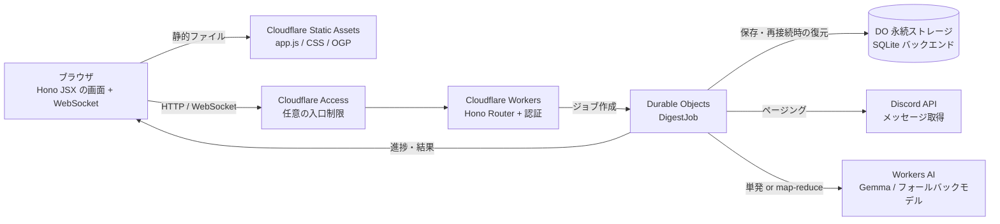

# Discord Digest

Discord のチャンネルやスレッドを期間指定で取得し、日本語で要約する Web ツールです。
アプリケーションは Cloudflare Workers 上で動作し、要約ジョブの状態管理には Durable Objects、
要約処理には Workers AI を使用します。

## アーキテクチャ



### 処理の流れ

1. ブラウザが Hono の `POST /api/digest` にチャンネル、期間、任意のプロンプトを送る。
2. Worker は Durable Object をジョブ ID で取得し、処理を開始してすぐに `jobId` を返す。
3. `DigestJob` が Discord API からメッセージを取得し、Workers AI で要約する。
4. 進捗と結果は Durable Object の SQLite に保存し、WebSocket 接続中のブラウザへ配信する。
5. ブラウザを閉じてもジョブは継続し、同じ `#job=...` の URL を開くと保存済みの状態へ再接続できる。

## Cloudflare の役割

| サービス | 役割 |
| --- | --- |
| **Workers** | エッジでリクエストを受け、Hono のルーティングと認証を実行するサーバーレス実行環境 |
| **Hono** | Worker エントリポイントのルーター。認証ミドルウェア、HTML レンダリング、API、WebSocket の入口をまとめる |
| **Durable Objects** | ジョブ ID ごとに1つの `DigestJob` を割り当て、長時間処理と状態を一貫して管理する |
| **Durable Objects SQLite** | Durable Object の永続ストレージを SQLite バックエンドで提供し、進捗、要約結果、ジョブ状態を保存する |
| **Workers AI** | Discord の会話を要約する。大きな入力は map-reduce、小さな入力は単発で処理する |
| **Static Assets** | `public/` の JavaScript、CSS、OGP 画像を Worker のコードとは別に配信する |
| **Cloudflare Access** | デプロイ後の入口を許可したユーザーに制限する。アプリ内のセッション認証とは別の防御層 |

## Hono と Worker の構成

`src/index.tsx` が Worker のエントリポイントです。Hono に認証ミドルウェアを全体適用し、
`/auth/*` だけを例外としてログイン処理へ渡します。

- `GET /` — Hono JSX でログイン後の画面をサーバーレンダリング
- `POST /api/digest` — Durable Object のジョブを作成
- `GET /api/digest/:id/ws` — 対象ジョブの Durable Object へ WebSocket を委譲
- `GET /auth/login` / `GET /auth/callback` — OAuth ログインと署名付きセッション Cookie の発行

Hono はルーティングと HTTP の境界を担当し、実際に時間のかかる Discord 取得・AI 要約は
`DigestJob` に分離しています。API はジョブ開始後すぐに応答するため、ブラウザの接続状態が
要約処理そのものを左右しません。

## Durable Objects でジョブを管理する理由

ジョブ ID を Durable Object の名前として使うことで、同じジョブの状態を常に同じオブジェクトで扱えます。
`ctx.waitUntil()` で処理をリクエストから切り離し、`acceptWebSocket()` で接続を管理するため、
ブラウザが切断してもジョブは続きます。

状態は Durable Object の永続ストレージ（SQLite バックエンド）に保存します。再接続時には `snapshot()` で現在の状態を返し、
実行中のジョブに一定時間進捗がなければエラーとして扱います。完了後はサーバー・クライアントの
両方で WebSocket を閉じ、不要に DO を起こし続けないようにしています。

## 要約処理

- Discord API のページングで最大 100 件ずつメッセージを取得する
- Discord の期間検索に対応するため、開始時刻を snowflake ID に変換して `after` に渡す
- 日本語を含む入力を保守的にトークン見積もりし、規模に応じて経路を切り替える
- 小さな入力は単発要約、大きな入力はチャンクごとの map と統合 reduce で処理する
- カスタムプロンプトは reduce 段階に適用し、チャンク処理で情報が早期に失われるのを防ぐ
- 会話ログはデータとして扱い、プロンプトインジェクション対策を施して AI に渡す

## セットアップ

### Discord Bot

1. [Discord Developer Portal](https://discord.com/developers/applications) で Bot を作成する
2. **Message Content Intent** を有効にする
3. Bot に **View Channel** と **Read Message History** を付けて対象サーバーへ招待する

### ローカル開発

```bash
npm install
cp .dev.vars.example .dev.vars
# .dev.vars に DISCORD_BOT_TOKEN=<Bot Token> を設定
npm run dev
```

初回は `wrangler login` が必要です。ローカル開発でも Workers AI は Cloudflare アカウントの
リソースを使用します。

### デプロイ

```bash
npx wrangler secret put DISCORD_BOT_TOKEN
npm run deploy
```

デプロイ後は Cloudflare Zero Trust の **Access → Applications → Self-hosted** で、
利用者を許可したメールアドレスなどに制限してください。`/api/` と WebSocket も Access を
通過できることを確認します。

## ディレクトリ構成

```text
src/
├── index.tsx          # Hono の Worker エントリポイントとルーティング
├── digest-job.ts      # DigestJob Durable Object、ジョブ実行、WebSocket 配信
├── discord.ts         # Discord API の取得・ページング・正規化
├── summarize.ts       # Workers AI の単発 / map-reduce 要約
├── auth.ts            # OAuth と署名付きセッション
├── ui.tsx             # Hono JSX による画面のサーバーレンダリング
├── client/            # ブラウザ側コード
└── types.ts           # Worker とクライアントで共有する型
public/                # Static Assets として配信するファイル
wrangler.jsonc         # Workers AI、DO、SQLite、Assets の設定
```

クライアントコードは `esbuild` で `public/app.js` にバンドルされます。`dev` と `deploy` が
自動的に実行するため、通常は手動操作は不要です。

## コマンド

```bash
npm run dev          # ローカル開発サーバー
npm run check        # lint、型チェック、テスト
npm test             # ユニットテスト
npm run lint:fix     # 自動修正可能な lint / format を修正
npm run deploy       # クライアントをビルドして Cloudflare Workers へデプロイ
```

## 制約

- Workers AI の無料枠は 10,000 Neurons/日です。
- Durable Objects の無料プランでは SQLite バックエンドを使用するため、マイグレーションは
  `new_sqlite_classes` を設定しています。
- Discord API と Workers AI は外部サービスのため、ユニットテストではなく実データでの手動確認が必要です。
- `public/` のファイルは認証を通らず公開されます。秘密情報は置かないでください。
